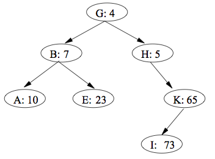
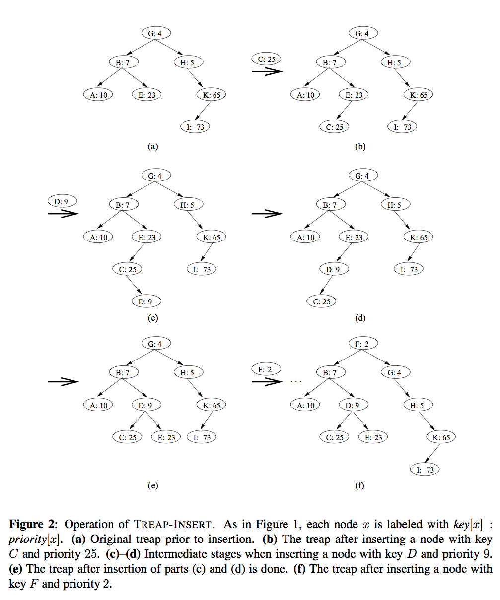

### Problem 1 (13.1-7): red-black tree

__(a)__ What is the largest possible number of internal nodes in a red-black tree with black height $$k$$?

__(b)__ What is the smallest possible number?

### Problem 2 (adapted from 13.3-2): red-black tree

The keys 41, 38, 31, 12, 19, 8 are successively inserted into an initially empty red-black tree.

__(a)__ Show the red-black tree after each of these insertions, as well as the intermediate steps that result from fixing up the tree after an insertion. Label these transformations by whether they represent case 1, 2 or 3. See figure 13.4 in the book for what your solution should look like.

__(b)__ Show the black-heights of all the nodes of the last red-black tree in part __(a)__.

### Problem 3 (adapted from problem 13-4): treaps

If we insert a set of $$n$$ items into a binary search tree, the resulting tree may be horribly unbalanced, leading to long search times. As we saw in class (and in Section 12.4), however, randomly built binary search trees tend to be balanced. Therefore, one strategy that, on average, builds a balanced tree for a fixed set of items would be to randomly permute the items and then insert them in that order into the tree.

What if we do not have all the items at once? If we receive the items one at a time, can we still randomly build a binary search tree out of them?

We will examine a data structure that answers this question in the affirmative. A __treap__ is a binary search tree with a modified way of ordering the nodes. Here is an example of a treap.

  
(Source: Cormen, Leiserson, Rivest and Stein, Introduction to Algorithms, 3rd Edition)

As usual, each item x in the tree has a key, key[x]. In addition, we assign priority[x], which is a random number chosen independently for each x. We assume that all priorities are distinct and also that all keys are distinct. The nodes of the treap are ordered so that (1) the keys obey the binary-search-tree property and (2) the priorities obey the min-heap order property. In other words,

* if v is a left child of u, then key[v] < key[u];
* if v is a right child of u, then key[v] > key[u]; and
* if v is a child of u, then priority(v) > priority(u).

(This combination of properties is why the tree is called a “treap”: it has features of both a binary search tree and a heap.)

It helps to think of treaps in the following way. Suppose that we insert nodes $$x_1,x_2,\dots,x_n$$, each with an associated key, into a treap in arbitrary order. Then the resulting treap is the tree that would have been formed if the nodes had been inserted into a normal binary search tree in the order given by their (randomly chosen) priorities. In other words, priority[$$x_i$$] < priority[$$x_j$$] means that $$x_i$$ is effectively inserted before $$x_j$$.

Let us see how to insert a new node x into an existing treap. The first thing we do is assign x a random priority priority[x]. Then we call the insertion algorithm, which we call TREAP-INSERT, whose operation is illustrated in the following figure:

  
(Source: Cormen, Leiserson, Rivest and Stein, Introduction to Algorithms, 3rd Edition)

__(a)__ Explain how TREAP-INSERT works. Explain the idea in English and give pseudocode. (Hint: Execute the usual binary search tree insert and then perform rotations to restore the min-heap order property.)

__(b)__ Show that the expected running time of TREAP-INSERT is O(log n).

## Submission

Homework should be submitted on Canvas as a __single PDF file__.

At the top of your file, include:

* your name
* CS 146
* the class section
* Homework [number]

Give credit to those who have helped you by including

* the name of any classmates you collaborated with
* the name of any other person you received help from
* a reference to any other source you may have used to in order to solve problems on this assignment.

All solutions must be written by yourself. Plagiarized work will not receive any credit. Repeated occurrences will result in a report to the department.

---
Options for making PDFs:

You have the option of handwriting your solutions on paper, scanning them, and converting them to PDF. Please do not send the images.
__If you use a phone or tablet__ to scan your handwritten solutions, [here are some tips on how to this well](http://www.howtogeek.com/209951/the-best-ways-to-scan-a-document-using-your-phone-or-tablet/).

You also have the option of typing your solutions up in your favorite word processor. Export or print your document as a PDF file and submit that. Please do not a submit .docx file.

Finally, you have the option of preparing a professional-looking document using LaTeX. This is what authors use to write textbooks and research papers. If you choose this option, here are some pointers to get you started.

* [Getting LaTeX](https://www.latex-project.org/get/)
* [LaTeX homework template](http://www.jennylam.cc/assets/template.zip): this is a good place to start learning LaTeX. Feel free to modify this document as you need.
* [Any of the many good LaTeX tutorials/cheatsheets/beginner's guides online](https://lmddgtfy.net/?q=Latex%20quickstart).

## Rubric

This assignment is worth 20 points:

* 6 points per problem, 3 for a reasonable attempt on it and 3 for correctness.
* 1 point for a correctly submitted assignment, that is, as a single PDF file that is legible (if you choose to take pictures, make sure the text is in focus, please check on a computer screen before submitting), properly oriented, etc.
* 1 point for presentation and neatness.
* 1 point for the extra credit problem if the code in the `main` function passes without errors, and the output is sorted. This code must still be correct when the input lists in `main` changes.
