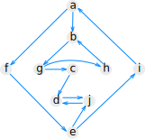

### Problem 1

__(a)__ Recall that __an adjacency matrix__ is a matrix whose rows and columns are indexed by the vertices, with a 1 in row i and column j if there is an edge from vertex i to vertex j.

   Draw the graph whose adjacency matrix is below, using circles for the vertices and arrows for the edges. Label each vertex with the number of its row and column.

$$\begin{pmatrix}
0 & 1 & 1 & 0 \\
1 & 0 & 0 & 0 \\
0 & 1 & 0 & 1 \\
1 & 0 & 1 & 0
\end{pmatrix}$$

__(b)__ An __adjacency list__ is an array indexed by the vertices. Each array cell points to a linked list of neighbor of that vertex). How many linked list nodes would be needed to represent the graph from part __(a)__?

__(c)__ In the __Python representation__ described by van Rossum, a graph is a dictionary whose keys are vertices and whose values are lists of the outgoing neighbors of each vertex (see the link for examples). Write down a Python expression that produces the van Rossum representation for the same graph. In this expression, use the number i to represent the vertex whose adjacencies are given by the i-th row of the matrix.

### Problem 2

Would you use the adjacency list structure or the adjacency matrix structure in each of the following cases? Justify your choice.

__(a)__ The graph has 10,000 vertices and 20,000 edges, and it is important to use as little space as possible.

__(b)__ The graph has 10,000 vertices and 20,000,000 edges, and it is important to use as little space as possible.

__(c)__ You need to answer the query `areAdjacent` as fast as possible, no matter how much space you use.

### Problem 3

For the graph below, draw a possible depth-first search forest. Label each edge by whether it is a tree edge, a backwards edge, a forward edge, or a cross edge. Additionally, label each vertex with the lowlink number that would be computed by Tarjan's strongly connected components algorithm, and list the strongly connected components.

{: style="width: 4in;"}

### Problem 4
__(a)__
Draw a graph, a designated starting vertex in your graph, and a sequence of the vertices that can be reached from the starting vertex, with the property that the sequence you give could have been generated by a depth first search, but not by a breadth first search.

__(b)__
Draw a graph, a designated starting vertex in your graph, and a sequence of the vertices that can be reached from the starting vertex, with the property that the sequence you give could have been generated by a breadth first search, but not by a depth first search.

## Submission

Problems 1 to 4 should be submitted on Canvas as a __single PDF file__.

At the top of your file, include:

* your name
* CS 146
* the class section
* Homework [number]

Give credit to those who have helped you by including

* the name of any classmates you collaborated with
* the name of any other person you received help from
* a reference to any other source you may have used to in order to solve problems on this assignment.

All solutions must be written by yourself. Plagiarized work will not receive any credit. Repeated occurrences will result in a report to the department.

---
Options for making PDFs:

You have the option of handwriting your solutions on paper, scanning them, and converting them to PDF. Please do not send the images.
__If you use a phone or tablet__ to scan your handwritten solutions, [here are some tips on how to this well](http://www.howtogeek.com/209951/the-best-ways-to-scan-a-document-using-your-phone-or-tablet/).

You also have the option of typing your solutions up in your favorite word processor. Export or print your document as a PDF file and submit that. Please do not a submit .docx file.

Finally, you have the option of preparing a professional-looking document using LaTeX. This is what authors use to write textbooks and research papers. If you choose this option, here are some pointers to get you started.

* [Getting LaTeX](https://www.latex-project.org/get/)
* [LaTeX homework template](http://www.jennylam.cc/assets/template.zip): this is a good place to start learning LaTeX. Feel free to modify this document as you need.
* [Any of the many good LaTeX tutorials/cheatsheets/beginner's guides online](https://lmddgtfy.net/?q=Latex%20quickstart).

## Rubric

This assignment is worth 20 points:

* 4.5 points per problem, 2.5 for a reasonable attempt on it and 2 for correctness.
* 1 point for a correctly submitted assignment, that is, as a single PDF file that is legible (if you choose to take pictures, make sure the text is in focus, please check on a computer screen before submitting), properly oriented, etc.
* 1 point for presentation and neatness.
