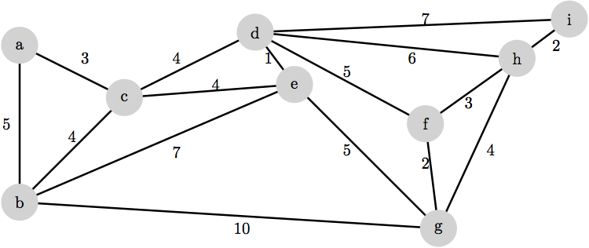

### Exercises

The following exercises cover required knowledge for this course. They should be solved but solutions to these will not be collected.

__(a)__ Illustrate the execution of the Prim Dijkstra-Jarnik algorithm on the following graph.

__(b)__ Illustrate the execution of Kruskal's algorithm on the same graph.

__(c)__ (8.3-1) Using figure 8.3 of the textbook as a model, illustrate the operation of radix sort on the following list of English words: cow, dog, sea, rug, row, mob, box, tab, bar, ear, tar, dig, big, tea, now, fox.

__(d)__ (8.4-1) Using figure 8.4 of the textbook as a model, illustrate the operation of bucket sort on the array A = [79, 13, 16, 64, 39, 20, 89, 53, 71, 42]

__(e)__ (8.3-2) Which of the following algorithms are stable: insertion sort, merge sort, heapsort, and quicksort? Give a simple scheme that makes any comparison sort stable. How much additional time and space does your scheme entail?

### Problem 1

Give an example of a weighted, connected, undirected graph, $$G$$, such that the minimum spanning tree for $$G$$ is different from every shortest-path tree rooted at a vertex of $$G$$.

### Problem 2

Let $$G$$ be a weighted, connected, undirected graph, and let $$V_1$$ and $$V_2$$ be a partition of the vertices of $$G$$ into two disjoint nonempty sets. Furthermore, let $$e$$ be an edge in the minimum spanning tree for $$G$$ such that $$e$$ has one endpoint in $$V_1$$ and the other in $$V_2$$. Give an example that shows that $$e$$ is not necessarily the smallest-weight edge that has one endpoint in $$V_1$$ and the other in $$V_2$$.

### Problem 3

Define the "first drop problem", on an input array $$A$$ of $$n$$ numbers, to be the problem of finding the first position at which one number drops to a smaller number after it. More formally, the output should be the smallest index $$i$$ for which $$A[i]>A[i+1]$$, or $$i=n-1$$ if no such index exists. For instance, on the input [5,9,2,4,1] the output should be 1, because the first drop is from the values 9 to 2, and the value 9 occurs at position $$A[1]$$. But on the input [1,2,4,5,9] there is no first drop and the output should be 4. You may assume that no two input numbers are equal.

__(a)__ When $$n=4$$, how many different outcomes does the first drop problem have?

__(b)__ Based only on your answer to part (a), and the $$\lceil\log_2(\# \text{outcomes})\rceil$$ lower bound on the height of any binary comparison tree, how many comparisons would be necessary to correctly solve the first drop problem for $$n=4$$?

__(c)__ Draw a comparison tree that uses as few comparisons as possible (in the worst case) to solve the first drop problem for $$n=4$$. How many comparisons in the worst case does your tree use?

### Problem 4

<del>(based on 8.4-2)</del>

<del>Explain why the worst-case running time for bucket sort is $$\Theta(n^2)$$. What simple change to the algorithm preserves its linear average-case running time and makes its worst-case running time $$O(n \log n)$$?</del>

Draw a decision/comparison tree for quicksort on inputs of length 3.

## Submission

Problems 1 to 4 should be submitted on Canvas as a __single PDF file__.

At the top of your file, include:

* your name
* CS 146
* the class section
* Homework [number]

Give credit to those who have helped you by including

* the name of any classmates you collaborated with
* the name of any other person you received help from
* a reference to any other source you may have used to in order to solve problems on this assignment.

All solutions must be written by yourself. Plagiarized work will not receive any credit. Repeated occurrences will result in a report to the department.

---
Options for making PDFs:

You have the option of handwriting your solutions on paper, scanning them, and converting them to PDF. Please do not send the images.
__If you use a phone or tablet__ to scan your handwritten solutions, [here are some tips on how to this well](http://www.howtogeek.com/209951/the-best-ways-to-scan-a-document-using-your-phone-or-tablet/).

You also have the option of typing your solutions up in your favorite word processor. Export or print your document as a PDF file and submit that. Please do not a submit .docx file.

Finally, you have the option of preparing a professional-looking document using LaTeX. This is what authors use to write textbooks and research papers. If you choose this option, here are some pointers to get you started.

* [Getting LaTeX](https://www.latex-project.org/get/)
* [LaTeX homework template](http://www.jennylam.cc/assets/template.zip): this is a good place to start learning LaTeX. Feel free to modify this document as you need.
* [Any of the many good LaTeX tutorials/cheatsheets/beginner's guides online](https://lmddgtfy.net/?q=Latex%20quickstart).

## Rubric

This assignment is worth 20 points:

* 4.5 points per problem, 2.5 for a reasonable attempt on it and 2 for correctness.
* 1 point for a correctly submitted assignment, that is, as a single PDF file that is legible (if you choose to take pictures, make sure the text is in focus, please check on a computer screen before submitting), properly oriented, etc.
* 1 point for presentation and neatness.
