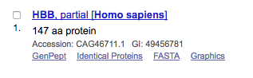
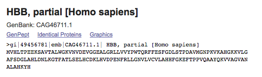

### Problem 1: Fibonacci sequence

Recall that the Fibonacci numbers are defined as follows:

$$\text{fib}(n) = \begin{cases}
1 & \text{if } n = 0 \text{ or } 1\\
\text{fib}(n - 1) + \text{fib}(n - 2) & \text{else}
\end{cases}$$

Consider the following naive implementation for computing the $$n$$-th Fibonacci number.

```
def fib(n):
    if n == 0 or n == 1:
        return 1
    return fib(n - 1) + fib(n - 2)
```

__(a)__ Draw the recursion tree corresponding to a call to $$\text{fib}(5)$$.

__(b)__ Possibly with the help of this tree, explain why the naive implementation is not an efficient implementation. In other words, where is there potential savings?

__(b)__ Propose an algorithm in code or pseudocode to compute the $$n$$-th Fibonacci number in $$\Theta(n)$$ time.

### Problem 2: making change

Recall the make-change problem:

* the input consists of a `value`, which is the amount that needs to be made change for, and a list of `denominations = [d0, d1, d2, ..., dn]`;
* the output is the minimum number of coins and/or bills needed to make change.

__(a)__ Write an efficient algorithm in code or pseudocode to solve this problem using the table-filling method.

__(b)__ What is the time complexity of this algorithm?

### Problem 3: longest common subsequence

Recall that in the longest common subsequence problem:

* the input is two sequences `seq1 = [x0, x1, ..., xn]` and `seq2 = [y0, y1, ..., yn]`;
* the output is the length of the longest common subsequence.

__(a)__ Write an efficient algorithm in code or pseudocode to solve this problem using the table-filling method.

__(b)__ What is the time complexity of this algorithm?

### Problem 4: sequence alignment (bonus)

__Note:__ this problem requires that you have a coded solution (rather than just pseudocode) for problem 3.

The longest common subsequence problem is used in bioinformatics to do "sequence alignment". By aligning DNA or protein sequences across species, we can gain insight into how closely related two species are (see Wikipedia article on  [divergent evolution](https://en.wikipedia.org/wiki/Divergent_evolution)).

One particular gene that is common to all species is hemoglobin, beta subunit, or HBB. Here we show the protein sequence (a string over a 20-character alphabet of amino acids, A-Z, minus BJOUXZ) corresponding to this gene for several species, which are listed in square brackets (for example, the first is Anas puna).

```
>gi|254770346|gb|ACT81418.1| hemoglobin beta A subunit [Anas puna]
MVHWTAEEKQLITGLWGKVNVADCGAEALARLLIVYPWTQRFFASFGNLSSATAITGNPMVRAHGKKVLT
SFGDAVKNLDNIKNTFAQLSELHCEKLHVDPENFRLLGDILIIVLAAHFTKDFTPECQAAWQKLVRVVAH
ALARKYH

>gi|73762242|gb|AAZ83609.1| Hbb [Borreliella garinii]
MSFSRRPKITKSDIVDQISLNIRNNNLKLEKKYIRLVIDAFFEELKGNLCLNNVIEFRSFGTFEVRKRKG
RLNARNPQTGEYVKVLDHHVAYFRPGKDLKERVWGIKG

>gi|426367146|ref|XP_004050595.1| PREDICTED: hemoglobin subunit beta [Gorilla gorilla gorilla]
MVHLTPEEKSAVTALWGKVNVDEVGGEALGRLLVVYPWTQRFFESFGDLSTPDAVMGNPKVKAHGKKVLG
AFSDGLAHLDNLKGTFATLSELHCDKLHVDPENFKLLGNVLVCVLAHHFGKEFTPPVQAAYQKVVAGVAN
LSS

>gi|49456781|emb|CAG46711.1| HBB, partial [Homo sapiens]
MVHLTPEEKSAVTALWGKVNVDEVGGEALGRLLVVYPWTQRFFESFGDLSTPDAVMGNPKVKAHGKKVLG
AFSDGLAHLDNLKGTFATLSELHCDKLHVDPENFRLLGNVLVCVLAHHFGKEFTPPVQAAYQKVVAGVAN
ALAHKYH

>gi|171854971|dbj|BAG16710.1| hemoglobin beta chain subunit [Mus musculus]
MVHLTDAEKAAVSGLWGKVNSDEVGGEALGRLLVVYPWTQRYFDSFGDLSSASAIMGNAKVKAHGKKVIT
AFNEGLNHLDSLKGTFASLSELHCDKLHVDPENFRLLGNMIVIVLGHHLGKDFTPAAQAAFQKVMAGVAT
ALAHKYH

>gi|431832732|gb|AGA93060.1| hemoglobin beta A subunit [Oxyura ferruginea]
MVHWTAEEKQLITGLWGKVNVADCGAEALARLLIVYPWTQRFFSSFGNLSSPTAILGNPMVRAHGKKVLS
SFGDAVKNLDNIKNTFAQLSELHCDKLHVDPENFRLLGDILIIVLAAHFSKDFTPDCQAAWQKLVRVVAH
ALARKYH

>gi|185132519|ref|NP_001117138.1| hemoglobin subunit beta [Salmo salar]
MVDWTDAERSAIVGLWGKISVDEIGPQALARLLIVSPWTQRHFSTFGNLSTPAAIMGNPAVAKHGKTVMH
GLDRAVQNLDDIKNAYTALSVMHSEKLHVDPDNFRLLADCITVCVAAKLGPTVFSADIQEAFQKFLAVVV
SALGRQYH

>gi|51593148|gb|AAH78472.1| Hbb protein, partial [Xenopus laevis]
MVHLSADEKSAINAVWSKVNIENDGHDALTRLLVVFPWTQRYFSSFGNLSNVAAISGNAKVRAHGKKVLS
AVDESIHHLDDIKKKKKKKKKKK
```

__(a)__ order the species listed above by how closely related you believe they are to humans. You may need to do a web search to find out what animals each of the scientific names in square brackets represents.

__(b)__ order the species above by the length of the longest common subsequence between their HBB protein sequence and human HBB protein sequence. Does this serve to confirm your prior knowledge or to refute it? Any surprises?

__Source:__ [National Center for Biotechnology Information](https://www.ncbi.nlm.nih.gov)  
Here is how you find the data for the human HBB:


The first search result:



Click on __FASTA__:



__Acknowledgements:__ many thanks to Dr. Phil Heller, for the inspiration, discussions, pointers, suggestions, which made this problem possible.


## Submission

Solutions should be turned in on Canvas as a __single PDF file__. Here are some options for how to do this:

You have the option of handwriting your solutions on paper, scanning them, and converting them to PDF. Please do not send the images.

__If you use a phone or tablet__ to scan your handwritten solutions, [here are some tips on how to this well](http://www.howtogeek.com/209951/the-best-ways-to-scan-a-document-using-your-phone-or-tablet/).

You also have the option of typing your solutions up in your favorite word processor. Export or print your document as a PDF file and submit that. Please do not a submit .docx file.

Finally, you have the option of preparing a professional-looking document using LaTeX. This is what authors use to write textbooks and research papers. If you choose this option, here are some pointers to get you started.

* [Getting LaTeX](https://www.latex-project.org/get/)
* [LaTeX homework template](http://www.jennylam.cc/assets/template.zip): this is a good place to start learning LaTeX. Feel free to modify this document as you need.
* [Any of the many good LaTeX tutorials/cheatsheets/beginner's guides online](https://lmddgtfy.net/?q=Latex%20quickstart).


## Rubric

This assignment is worth 20 points:

* 6 points per problem, 3 for a reasonable attempt on it and 3 for correctness.
* 1 point for a correctly submitted assignment, that is, as a single PDF file that is legible (if you choose to take pictures, make sure the text is in focus, please check on a computer screen before submitting), properly oriented, etc.
* 1 point for presentation and neatness.
* 1 point for the extra credit (bonus) problem if solved correctly.
