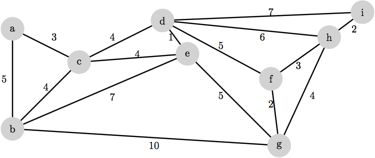

# Description

The goal of this assignment is to master the following concepts:

- use the PriorityQueue ADT to design algorithms and data structures
- explain the single source shortest path problem and the minimum spanning tree problem
- Breadth-First search algorithm
- Dijkstra's algorithm
- Prim-Dijkstra-Jarnik algorithm
- Kruskal's algorithm
- for each of these algorithms
    - explain and implement the algorithm
    - explain what problem the algorithm solves
    - explain the running time and its dependence on the data structure implementation (for Dijkstra and PDJ)

# Submission

You will package your assignment as a __single PDF file__ and submit it on Canvas.

For suggestions on how to make a pdf file, please refer to [Homework 1 - Submission](homework01.html#Submission).

# Exercises (not to be submitted)

The following exercises cover required knowledge for this course. They should be solved but solutions to these will not be collected.




__(a)__ Illustrate the execution of breadth-first search on the graph above, treating it as an unweighted graph (all edges have a weight of 1), and with vertex $$e$$ as the source.

__(b)__ Illustrate the execution of Dijkstra's algorithm on the graph above, together with $$e$$ as the source.

__(c)__ Illustrate the execution of the Prim Dijkstra-Jarnik algorithm on the graph above, starting at $$e$$.

__(d)__ Illustrate the execution of Kruskal's algorithm on the graph above.

__(e)__ Implement Dijkstra's algorithm in Java.

# Problems to submitted

### Problem 1: analysis of Dijkstra's algorithm under different implementations of a priority queue

Suppose we wish to compute shortest paths in a complete directed graph (a directed graph in which there exists an edge in each direction between every two vertices), with positive edge weights (so that Dijkstra's algorithm may be used). But rather than using a complicated priority queue data structure, we use an unsorted list $L$ of the vertices that have not yet been processed. That is, the simplified version of Dijkstra's algorithm performs the following steps:

```
initialize the dist and prev information used in the original Dijkstra's algorithm

initialize L to be a list of all the vertices in the graph

while L is not empty {
    look at all of the vertices in L to find the vertex v with
    the minimum value of dist.get(v)

    remove v from L

    for each edge v->w
        relax(v->w)
}
```

You may assume that looking at all vertices in $$L$$ takes time proportional to the number of vertices examined, and that removing v from $$L$$ takes constant time.

__(a)__ What is the running time of this algorithm, using $O$-notation, as a function of the number $$n$$ of vertices and the number $$m$$ of edges in the input graph?

__(b)__ Would this algorithm be a better or worse choice than the more usual form of Dijkstra's algorithm using a binary heap (whose operations are all $$O(\log n)$$, except for makeQueue(), which is $$O(n)$$ to insert n elements), for this type of graph? Explain your answer.


### Problem 2: correctness of Dijkstra's algorithm

<ins>A negative (-weight) cycle is a cycle in which the sum of the edges is negative. For example, the cycle A ---(2)--> B ---(-5)---> C ---(2)---> A is a negative cycle, but A ---(-2)---> B ---(3)---> C ---(1)---> A is not a negative cycle.</ins>

Give an example of an weighted directed graph, $G$, with negative-weight edges but no negative-weight cycle, such that Dijkstra's algorithm incorrectly computes the shortest-path distances from some start vertex $$v$$.
