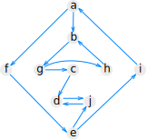

# Description

The goal of this assignment is to master the following skills and concepts:

- reinforce the backtracking and memoization backtracking techniques
- describe the stack ADT and its methods and cite examples of its use in different algorithms
- Graham's scan algorithm including
- depth first search
- Tarjan's algorithm
- for each of these algorithms, be able to describe
    - what problem it solves, or in the case of DFS, give examples of how DFS can be adapted to solve different problems
    - describe the algorithm in code or pseudocode
    - understand the time complexity of this algorithm and its analysis
    - any loop invariants
- in addtion for DFS    
    - given a DFS traversal, classify the edges of the graph as tree, backwards, forwards, or cross edges.
    - given a graph and a permutation of the vertices, determine if the permutation could have been obtained by a DFS traversal of the graph. the time complexity of this algorithm and its analysis
- understand what a strongly connected component is

 
# Submission

You will package your assignment as a __single PDF file__ and submit it on Canvas.

For suggestions on how to make a pdf file, please refer to [Homework 1 - Submission](homework01.html#Submission).

# Problems to be submitted

### Problem 1: more bactracking and memoization

Suppose that the coins of Combinatoria come in the denominations $$d_1, \dots d_k$$. where $$d_1 = 1$$ and the other values $$d_i$$ values for a set of distinct integers greater than 1. Given an integer, $$n >0$$, the problem of making change is to find the fewest number of Combinatorian coins whose values sum to $$n$$.

__(a)__ Give an instance of the making-change problem for which it is suboptimal to use the standard greedy algorithm, which repeatedly chooses a highest-valued coin whose value is at most $$n$$ until the sum of chosen coins equal $$n$$.

__(b)__ Describe an efficient algorithm for solving the problem of making change. What is the running time of your algorithm?

### Problem 2: find the convex hull

__(a)__ Draw the convex hull of the following set of points:

$$\{(2,2), (4,4), (6,4), (8,1), (8,7), (9,3), (1,5), (5,4)\}.$$

__(b)__ Suppose that we run Graham's scan on this set of points. Describe the sequence of pushes and pops that are applied to the stack. Your answer should have the format: push (x1, y1), push (x4, y4), pop, push (x3, y3)...

### Problem 3: BFS and DFS

__(a)__
Draw a graph, a designated starting vertex in your graph, and a sequence of the vertices that can be reached from the starting vertex, with the property that the sequence you give could have been generated by a depth first search, but not by a breadth first search.

__(b)__
Draw a graph, a designated starting vertex in your graph, and a sequence of the vertices that can be reached from the starting vertex, with the property that the sequence you give could have been generated by a breadth first search, but not by a depth first search.

### Problem 4: Tarjan's algorithm

For the graph below, draw a possible depth-first search forest. Label each edge by whether it is a tree edge, a backwards edge, a forward edge, or a cross edge. Additionally, label each vertex with the lowlink number that would be computed by Tarjan's strongly connected components algorithm, and list the strongly connected components.

{: style="width: 4in;"}

# Problems not to be submitted

### Depth first search

1. given a DFS traversal, classify the edges of the graph as tree, backwards, forwards, or cross edges.
2. given a graph and a permutation of the vertices, determine if the permutation could have been obtained by a DFS traversal of the graph.

### Strongly connected components

1. Draw a graph. Find its strongly connected components.
2. Why are there two different notions of connectedness, one for directed graphs, and one for undirected graphs? Why doesn’t one carry over to the other? Which is the type of graph, directed or undirected, for which it makes sense to talk about SCCs?
3. Give the formal definition of a strongly connected component of a graph.
4. Draw a graph on n vertices and with as many edges as possible, and with as many SCCs as possible.

# Acknowledgements

Problem 4 is taken from Algorithm Design and Applications by Michael T. Goodrich and Roberto Tamassia.
