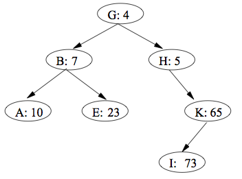

# Description

The goal of this assignment is to master the following skills and concepts:

1. solve problems recursively and implement them using dynamic programming
2. analyze the time and space complexity of an implementation which uses dynamic programming
1. understand and be able to explain heaps
2. understand and be able to explain heapsort
3. be able to use heaps to design algorithms and data structures
4. be able to distinguish the nature and function of heaps versus binary search trees

# Submission

You will package your assignment as a __single ZIP file__ and submit it on Canvas. The package should include a pdf file for the written portion of your work and .java files for the code.

For suggestions on how to make a pdf file, please refer to [Homework 1 - Submission](homework01.html#Submission).

# Problems to be submitted

### Problem 1: dynamic programming

Consider the following problem:

* input: a sequence of $$n$$ items with weights `[w1, w2, .... wn]` and dollar amounts `[v1, v2, ..., vn]`, and an integer `max_weight`
* output: the maximum dollar amount that can be achieved by selecting a subset of these items whose total weight is less than or equal to `max_weight`

Assume that there is at least one item, and that all weights an dollar amounts are non-negative. Unlike in the make-change problem, once an item is chosen, it may not be "re-chosen" again.

__(a)__ Give a recursive solution for this problem. In other words, express this problem in terms of subproblems. Hint: review the [maximum subset sum problem](//github.com/jnylam/SJSU-cs146-s17/blob/master/04_Backtracking/src/cc/jennylam/cs146/BacktrackingProblems.java)

__(b)__ Give a dynamic programming solution to this problem in Java (include the solution as a java file).

__(c)__ What is the time complexity and space complexity of this solution? Justify your answer.

### Problem 2: heap

__(a)__ Is there a (min-)heap $T$ storing seven distinct elements such that a preorder traversal of $T$ yields the elements of $T$ in sorted order?

__(b)__ How about an inorder traversal?

__(c)__ How about a postorder traversal?

### Problem 3 (adapted from problem 13-4): treaps

If we insert a set of $$n$$ items into a binary search tree, the resulting tree may be horribly unbalanced, leading to long search times. As we saw in class (and in Section 12.4), however, randomly built binary search trees tend to be balanced. Therefore, one strategy that, on average, builds a balanced tree for a fixed set of items would be to randomly permute the items and then insert them in that order into the tree.

What if we do not have all the items at once? If we receive the items one at a time, can we still randomly build a binary search tree out of them?

We will examine a data structure that answers this question in the affirmative. A __treap__ is a binary search tree with a modified way of ordering the nodes. Here is an example of a treap.

  
(Source: Cormen, Leiserson, Rivest and Stein, Introduction to Algorithms, 3rd Edition)

As usual, each item x in the tree has a key, key[x]. In addition, we assign priority[x], which is a random number chosen independently for each x. We assume that all priorities are distinct and also that all keys are distinct. The nodes of the treap are ordered so that (1) the keys obey the binary-search-tree property and (2) the priorities obey the min-heap order property. In other words,

* if v is a left child of u, then key[v] < key[u];
* if v is a right child of u, then key[v] > key[u]; and
* if v is a child of u, then priority(v) > priority(u).

(This combination of properties is why the tree is called a “treap”: it has features of both a binary search tree and a heap.)

It helps to think of treaps in the following way. Suppose that we insert nodes $$x_1,x_2,\dots,x_n$$, each with an associated key, into a treap in arbitrary order. Then the resulting treap is the tree that would have been formed if the nodes had been inserted into a normal binary search tree in the order given by their (randomly chosen) priorities. In other words, priority[$$x_i$$] < priority[$$x_j$$] means that $$x_i$$ is effectively inserted before $$x_j$$.

Let us see how to insert a new node x into an existing treap. The first thing we do is assign x a random priority priority[x]. Then we call the insertion algorithm, which we call TREAP-INSERT, whose operation is illustrated in the following figure:

  
(Source: Cormen, Leiserson, Rivest and Stein, Introduction to Algorithms, 3rd Edition)

__(a)__ Explain how TREAP-INSERT works. Explain the idea in English and give pseudocode. (Hint: Execute the usual binary search tree insert and then perform rotations to restore the min-heap order property.)

__(b)__ Show that the expected running time of TREAP-INSERT is O(log n).

# Additional practice questions (not to be submitted)

1. What is a max-heap? What is a min-heap?
  2. What is the run time complexity of insertion sort, heapsort, mergesort and quicksort?
  3. Which of these algorithms is an-in place algorithm?
  4. Describe heapsort: at a high-level and in pseudocode.
  5. Describe heapify: what does it accomplish (input, output), what is the high-level idea and give the pseudocode?
  6. Break down the analysis of heapsort: what is the runtime of heapify? what is the run time of the rest of heapsort?
  7. What is the definition of a heap? What is the heap property? What operations can be done on a heap?
  8. What is the fewest and maximum number of nodes a heap of height 4 can have?
  9. What is the difference between a min-heap and a max-heap?
  10. Draw a min-heap with 7 nodes. Draw the contents of the heap as the min is deleted.
  11. Describe deletion from a heap: at a high-level and in pseudocode.
  12. Draw a min-heap with 7 nodes. Pick a new value and draw the contents of the heap as the min is inserted.
  13. Describe insertion into a heap: at a high-level and in pseudocode. (Note: not covered in class, see textbook as well as a similar idea applied in Homework 
  14. What is the run-time of heapify? The run time of insertion into a heap? Deletion of the min?
