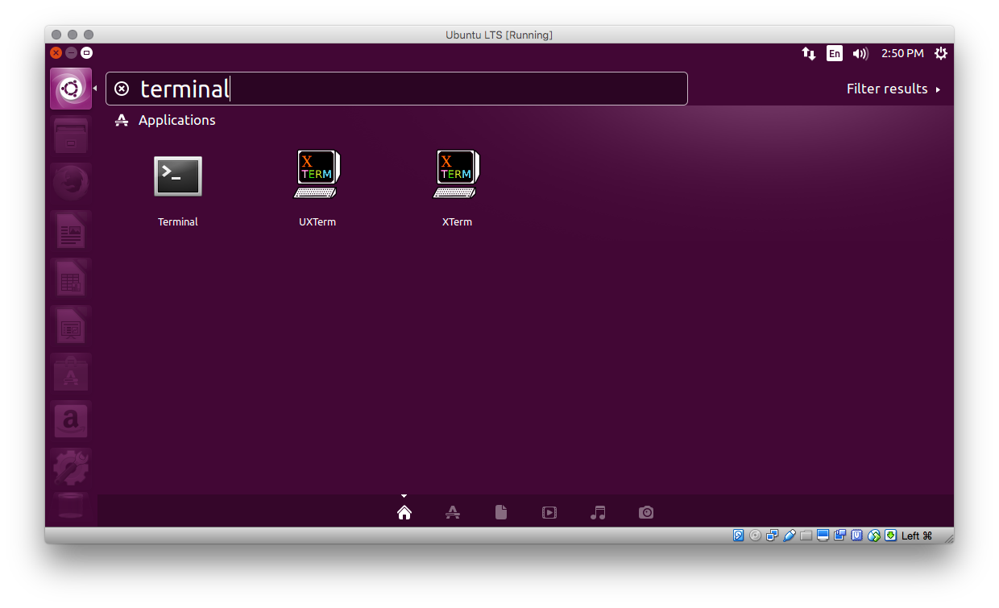

## Part 1: install Linux

If you already have a version of Linux installed on your computer, you can skip this part.

If you are using Windows or Mac OS X, do the following:

1. install [VirtualBox](https://www.virtualbox.org/wiki/Downloads)
2. download [Ubuntu Desktop](http://www.ubuntu.com/download/desktop).
3. install Ubuntu on VirtualBox.

__Video tutorial:__ [Installing Ubuntu on VirtualBox](https://www.youtube.com/watch?v=LIuRUvr03as&list=PLMhjbbkN7ahyejodIucz5h-mBruTctFS3&index=2)

Note: although we will give instructions for Ubuntu below, you are welcome to use a different Linux distribution if you are already familiar with the Linux environment.

## Part 2: run forktest

### Step 1
In Linux, fire up a terminal.



### Step 2
Go to your home directory, create a directory called `forktest` and go in that new directory.

```ruby?line_numbers=false
cd ~
mkdir forktest
cd forktest
```

Note: `cd`: change directory, `mkdir`: make (create) directory, `rmdir`: remove (delete) directory. `~` is called the home directory. It's the one that belongs to the user that is currently logged in, and whose purpose is to store the user's personal files.

__Question 1__: Which directories are in your home directory? Use `ls` (list) to answer this question.

### Step 2

Download the file [forktest.c](forktest.c) using the `wget` command:

```
wget www.jennylam.cc/courses/149-f16/forktest.c .
```

### Step 3

Compile and run `forktest.c`:

```bash
gcc –o forktest forktest.c
./forktest
```

Note: `gcc` is the Gnu Compiler Collection. By typing `./forktest`, the user indicates that they really meant to run the `forktest` binary located in the current directory `./`. This is a safety feature which prevents accidentally running a program with the same name that was installed somewhere else in the system (perhaps without the user's knowledge).

### Step 4

Run it again, and this time, save the output of the run to a file.

```
./fortest.c > forktest.out
```

How many lines are in the file?

```
wc -l forktest.out
```

__Question 2.__ What does the command `wc` without the `-l` flag do? Type `man wc` for the user's __man__ ual for `wc`.

### Step 5

View the file on your terminal

```
cat forktest.out
```

__Question 2.__ What was the output of the file? Which line was run by which PID? If the output is different from the one given for `p1.c` in [Chapter 5](http://pages.cs.wisc.edu/~remzi/OSTEP/cpu-api.pdf), can you explaining what is happening?

## Part 3: processes on Linux

### Step 1

Read about the [proc filesystem](https://en.wikipedia.org/wiki/Procfs#Linux).

### Step 2

Use `top` to find out the PID of the current session of the terminal.

### Step 3

Go to the directory in the proc file system that corresponds to the process running the current session of the terminal.

```
cd /proc/PID
```

where PID is the one for the current terminal session. To make sure you are in the correct directory, use `pwd` (path to current working directory).


### Step 4

List the files and directories under this directory.

```
ls .
```

The period represents the current directory. Add the flag `-R` to also list files inside the subdirectories and so on. `-R` stands for "recursive".

__Question 3.__ How many child processes were created by the current one? (Hint: use the Wikipedia article to find out which file or directory contains that information). List the sequence of commands and corresponding outputs that lead to your answer.

### Step 5

Kill your terminal
```
kill PID
```

where PID is the one for your terminal.

__Question 4.__ What happens when you run this command?

## Part 4: investigating system calls

__Question 5.__ What does the `echo` command do?

__Question 6.__ How many system calls are made when running `echo "hello"`? Use `strace`, a command that lists all the system calls used for a given command.

__Question 7.__ Running the same command, which is the system call that writes to the terminal? Include the input and output parameters.

__Question 8.__ What do the integers in the input and output parameters of this system call represent? Hint: read the documentation for this system call and include a reference to it.


## Part 5: screenshot

In the terminal, type `whoami`. Take a screenshot of your entire screen, capturing your desktop, your terminal, and inside of it, your command `whoami` as well as its output, which is the username you chose when installing Linux.

## Deliverables

Use a word processor to include your answers to these 8 questions and your screenshot. Include your name and the words "Homework 1" at the beginning. Export your document to a single PDF file and submit it on Canvas. The due date is listed in the schedule.

## Rubric

This assignment is to be completed individually and is worth 10 points:

* 1 point per question for a reasonable answer properly supported with relevant information.
* 1 point for the screenshot, satisfying the requirements for that screenshot.
* 1 point for a properly prepared document, with correct file format and reasonable presentation.

## Acknowledgements

This assignment is based on a project in the Operating Systems course taught by Ron Mak.
