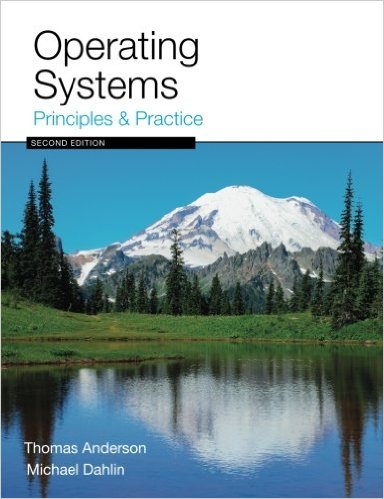

## Course and Contact Information

__Instructor:__  Jenny Lam  
__Office location:__  MacQuarrie Hall 211 (MH 211)  
__Email:__ [jenny.lam01@sjsu.edu](mailto:jenny.lam01@sjsu.edu)  
__Office hours:__ MW 3:00PM-4:00PM or by appointment  
__Class days/time:__ MW 7:30AM-8:45AM  
__Classroom:__ MacQuarrie Hall 222  (MH 222)  
__Prerequisites__: CS 146 or SE 146 (with a grade of "C-" or better)

## Course Description

Fundamentals: Contiguous and non-contiguous memory management; processor scheduling and interrupts; concurrent, mutually exclusive, synchronized and deadlocked processes; files. Substantial programming project required.

## Course Goals

* To introduce students to the role of an operating system as a hardware resource manager, and where the OS fits into the software application layer
* To acquaint students with the need to perform memory management, and to explain to them the various memory management techniques and their tradeoffs
* To help students appreciate how the CPU itself is managed by the operating system
* To educate students about the computer deadlock problem, how deadlocks are not unique to the computer system, and attempted solutions to fix the deadlock problem
* To instruct students about processes, their creation, and the software race condition that can happen
when multiple processes are run concurrently and perform IPC
* To ensure that students are familiar with the classic IPC problems and how to use semaphores in their software development process to avoid race conditions

## Course Learning Outcomes (CLO)

Upon successful completion of this course, students will be able to:

1. Understand the role that the operating system software plays in the management of the various hardware subsystems of the computer system.
2. Understand locality of memory reference and how it is used to perform effective memory hierarchy management.
2. Understand the various mapping, replacement, and dynamic allocation algorithms for cache and virtual memory management.
3. Understand the alternative CPU scheduling schemes, their tradeoffs, and their applications to other queue processing situations.
4. Appreciate the difficult tradeoffs faced when attempting to deal with the resource deadlock problem and distinguish between the different deadlock prevention and avoidance schemes and understand why and how deadlocks can still happen today.
5. Understand software race conditions, their origin and the problems they can cause, along with knowing how to apply semaphores in software design to solve the race condition problem.
7. Understand the various issues associated with the operating system's role in performing I/O and file management.

## BS in CS Program Outcomes (PO)

(a) An ability to apply knowledge of computing and mathematics to solve problems  
(b) An ability to analyze a problem, and identify and define the computing requirements appropriate to its solution  
(c) An ability to design, implement, and evaluate a computer-based system, process, component, or program to meet desired needs  
(i) An ability to use current techniques, skills, and tools necessary for computing practice  
(j) An ability to apply mathematical foundations, algorithmic principles, and computer science theory in the modeling and design of computer-based systems in a way that demonstrates comprehension of the tradeoffs involved in design choices  
(k) An ability to apply design and development principles in the construction of software systems of varying complexity  

## Required Texts/Readings

### Textbook

{: style="width: 10rem;"}

Operating Systems: Principles and Practice, 2nd Edition, Thomas Anderson, Michael Dahlin, Recursive Books, ISBN-13: 978-0985673529

### Other technology requirements / equipment / material

Students should bring a laptop to every lecture, with sufficient charge to last the entire lecture. The classroom has limited electrical outlets, to which access cannot be guaranteed.

## Course Requirements and Assignments

The grade in this course will be weighted as follows:

__Participation:__ although there is no grade incentive, students are expected to attend every class and actively participate.

__Assignments:__ (50%) assignments are assigned roughly every week and will consist of a mix of programming and written problems. Students will be encouraged to work in pairs, but may also choose to work alone. Grading will be done according to the same rubric regardless of the arrangement, and students who worked together will receive the same grade. The two lowest grades will be dropped. Late work is not accepted.

__Exams:__ there will be two in-class exams (15% each) and a comprehensive final exam (20%), to be taken individually. Missed exams cannot be made up except for reasons of illness as certified by a doctor, or documentable extreme emergency. Makeup exams may be oral.

Extra credit problems may be given as part of assignments and exams, the scoring of which may not result in changing the relative weights between assignments and exams.

__Letter grade:__ the final numerical score will translate to the course letter grade according to the following scale:

Percentage|Letter grade
----------|------------
[90-100)|A
[75-90)|B
[60-75)|C
[50-60)|D
[0-50)|F

## University Policies

Per University Policy S16-9, university-wide policy information relevant to all courses, such as academic integrity, accommodations, etc. will be available on Office of Graduate and Undergraduate Programs’ [Syllabus Information web page](http://www.sjsu.edu/gup/syllabusinfo/) at http://www.sjsu.edu/gup/syllabusinfo/

## CS 149 section 3, Operating systems, Fall 2016, Course Schedule

[Course Schedule](index.html)
