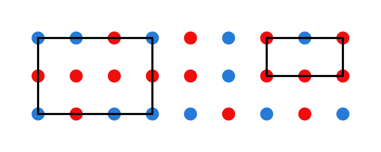

Due date: Wednesday 3/30/2016 in class  
Instructions: please turn in each part stapled separately. Label each part with

* your name,
* homework number,
* part and
* instructor name.

Please do not use paper torn off of a notebook.

## Part 1

### Problem 1
A palindrome is a string whose reversal is identical to the string. How many bit-strings of length $$n$$ are palindromes? Leave your answer unsimplified. Justify with a combinatorial argument.

### Problem 2
In how many ways can a photographer at a wedding arrange six people in a row, including the bride and the groom, if

__a)__ the bride must be next to the groom  
__b)__ the bride must not be next to the groom  
__c)__ the bride must somewhere to the left of the groom  

Leave your answer unsimplified. Justify with a combinatorial argument.

### Problem 3
How many numbers between 100 and 1000 (inclusive) are divisible by 2 or 5? Leave your answer unsimplified. Justify with a combinatorial argument.

### Problem 4
How many bit strings of length 8 have <del>three</del> <ins>five</ins> or more consecutive 0's? Leave your answer unsimplified. Justify with a combinatorial argument.

### Problem 5
Show that if $$n$$ is a positive integer, then $$\binom{2n}{2} = 2 \binom{n}{2} + n^2$$

__a)__ using a combinatorial argument  
__b)__ by algebraic manipulation  

### Problem 6
Show that a set has the same number of subsets with an odd number of elements as it does subsets with an even number of elements. Translate this result into an equation in terms of binomial coefficients. Hint: find a bijection between the set of subsets with an odd number of elements and the set of subsets with an even number of elements.

### Problem 7
What is the coefficient of $$x^7$$ in $$(1 + x)^{11}$$? Leave your answer unsimplified. Justify.

## Part 2

### Problem 8
How many ways are there of choosing five cards from a deck of cards containing two cards of the same rank, plus two cards of another rank (that match each other but not the first pair), plus any card not of either rank? (Such a combination of cards is called a two pair.) Leave your answer unsimplified. Justify using a combinatorial argument.

### Problem 9
The English alphabet contains 21 consonants and five vowels. How many strings of six lower case letters of the English alphabet contains

__a)__ exactly one vowel?  
__b)__ exactly two vowels?  
__c)__ at least one vowel?  
__d)__ at least two vowels?

Leave your answer unsimplified. Justify using a combinatorial argument.

### Problem 10
Seven women and nine men are on the faculty in the computer science department.

__a)__ How many ways are there to select a committee of five members of the department if at least one man and one woman must be on the committee?  
__b)__ How many ways are there to select a committee of six members of the department if it must have more women than men?

Leave your answer unsimplified. Justify using a combinatorial argument.

### Problem 11
A computer network consists of six computers. Each computer is directly connected to at least one other computer. Show that there are at least two computers in the network that are directly connected to the same number of other computers.

### Problem 12
Consider a 3 by 9 grid of red and blue dots. Show that __any__ such a grid always contains four dots arranged as a rectangle which all have the same color. The illustration below shows a colored grid with two such rectangles identified.

### Problem 13
Construct a sequence of 16 <ins>different</ins> positive integers that has no strictly increasing or strictly decreasing subsequence with 5 terms. How many positive integers are needed to guarantee the existence of an increasing or decreasing subsequence with 5 terms?
