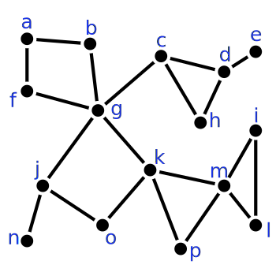

Due date: Wednesday 5/4/2016 in class  
Instructions: please turn in each part stapled separately. Label each part with

* your name,
* homework number,
* part and
* instructor name.

Please do not use paper torn off of a notebook.

---

## Part 1

### Problem 1

__a)__ Show that $$Q_3$$ is a planar graph. Hint: find a planar drawing of it.  
__b)__ Show that $$Q_4$$ is not planar. Hint: use one of the corollaries of Euler's formula.

### Problem 2

For each of the following planar drawings of graphs, find its dual graph.

__a)__  
{: style="width: 1in;"}  
__b)__  
{: style="width: 1in;"}

### Problem 3

Euler’s formula for connected planar graphs is: $$n - m + k = 2$$, where $$n$$ is the number of vertices, $$m$$ the number of edges and $$k$$ the number of faces. Find a similar formula for a planar graph with $$c$$ connected components. Your formula should use $$n$$, $$m$$, $$k$$ and $$c$$.

### Problem 4

Show that every connected planar graph has a vertex of degree at most 5.

### Problem 5

For which values of $$r$$ and $$s$$ is the complete bipartite graph $$K_{r,s}$$ non-planar? Justify your answer.

## Part 2

### Problem 6

A __2-connected component__ of a graph $$G$$ is a maximally connected 2-connected subgraph of $$G$$. Find the 2-connected components in the following graph. Note: 2-connected components can share vertices.

{: style="width: 3in;"}

### Problem 7

Recall that a __hamiltonian cycle__ is a cycle in a graph that visits every vertex exactly once. Show that a graph with a hamiltonian cycle is 2-connected.

### Problem 8

In each of the following graphs, find an Euler cycle, an Euler path or explain why neither exist.

__a)__  
{: style="width: 2in;"}  
__b)__  
{: style="width: 2in;"}  
__c)__  
{: style="width: 2in;"}

### Problem 9

__a)__ For which values of $$r$$ and $$s$$ is the complete bipartite graph $$K_{r,s}$$ contain an Euler cycle?  
__b)__ For which values of $$r$$ and $$s$$ is the complete bipartite graph $$K_{r,s}$$ contain an Euler path?

<!--
Show that the 2-connected components of a graph form a tree.
-->
