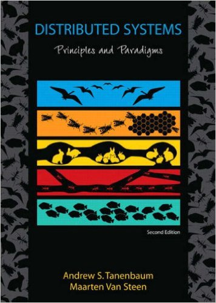

## General information and resources

Instructor: [Jenny Lam](mailto:jenny.lam@pomona.edu)  
Lectures: MW  11:00AM-12:15PM. HN Room 214 (Hahn Social Science Bldg)  
Office hours: TBD in Edmonds 231  
[Piazza](HTTP://WWW.piazza.com/pomona/spring2016/cs189a)  
[System hacker's view of software engineering](http://www.cs.cmu.edu/~dga/systems-se.pdf), David Andersen

{: style="width: 10rem;"}

Required textbook: Distributed Systems Principles and Paradigms, 2nd ed. Andrew S. Tanenbaum & Maarten Van Steen, Pearson. ISBN 0-13-239227-5.

## Assignments and grading

The final course grade in the class will be computed as a weighted average of the following assignments and then converted to a letter grade based on a scale that will be determined at the end of the semester.

* 45% projects
  * 5% project 1
  * 10% project 2
  * 15% project 3
  * 15% project 4
* 35% exams
  * 10% exam 1 (Monday 2/22/2016)
  * 10% exam 2 (Wednesday 3/30/2016)
  * 15% final exam (Monday 5/2/2016)
* 20% homework
  * roughly one assignment every week, all equally weighted

Projects and homework may be turned in late without prior notification or justification and will be subject to the following point deduction:

* 0&ndash;24 hours late: 3%
* 24&ndash;48 hours late: 9%
* 48&ndash;36 hours late: 27%
* 36+ hours late: assignment is no longer accepted

Only under documented extenuating circumstances, you may be granted a make-up exam or have an assignment due date postponed. If you need such an exception, please talk to the instructor as early as possible.

## Collaboration and academic honesty policy

As a student in this course, you are expected to understand and follow the academic honest policies of Pomona College (or your home campus) and the Department of Computer Science. Please take a few minutes to familiarize yourself with these policies:
[Department of Computer Science Academic Honesty Policy](//www.cs.pomona.edu/academichonesty); [Pomona College Academic Honesty Policy](http://catalog.pomona.edu/content.php?catoid=7&navoid=394).
Unless the instructions for an assignment explicitly allow a form of collaboration, assume that the standard academic honesty policies apply. If for any reason you do not understand how the academic policies apply to a particular course or assignment, discuss your concerns with the teaching staff for the course.

Submitted code may be analyzed by automated plagiarism detection software, which detects structural similarities in your code with other students submitted code (this quarter and in the past) and code available on Internet repositories.

All exams will be closed-note, closed-book, closed-computer and individual effort.

If you do not abide by the academic honest policies, expect severe penalties. The first offense will result in failure in the course and will be reported to the Dean of Students Office. In the event of a second offense, the offense will be reported to the Board of Academic Discipline. For further explanation of the penalties see the academic honest policies linked above.

## Academic accommodations

If you are seeking academic accommodations, you must contact your home college's disability coordinator to establish accommodations. You should plan to meet with your coordinator to discuss appropriate accommodations and may be asked to provide documentation necessary to verify disabilities. The disability coordinators for the Claremont Colleges are:
<a href='mailto:Jan.Collins-Eaglin@pomona.edu'>Jan Collins-Eaglin (Pomona)</a>,
<a href='mailto:julia.easley@claremontmckenna.edu'>Julia Easley (CMC)</a>,
<a href='mailto:Jill_Hawthorne@pitzer.edu'>Jill Hawthorne (Pitzer)</a>,
<a href='mailto:sdelator@scrippscollege.edu'>Sonia De la Torre Iniguez (Scripps)</a> and
<a href='mailto:hbird@hmc.edu'>Heidi Bird (HMC)</a>.

## Recording
Pomona College prohibits video or voice recording of any lecture or discussion, except in cases that the office of the Dean of Students has granted a student permission according to the College’s Disability Accommodations Policy, or when permission is granted by the instructor. I choose to give permission in this course to be recorded by students. These recordings are for any reasonable use that arises from participation in this course. __These recordings cannot be distributed, transmitted or published in any media or form, nor be used for any commercial purposes.__

## Acknowledgements

The design of this course is based on the course [Distributed Systems](http://www.cs.cmu.edu/~dga/15-440/S14), taught by David Andersen and Srini Seshan at Carnegie Mellon University.
